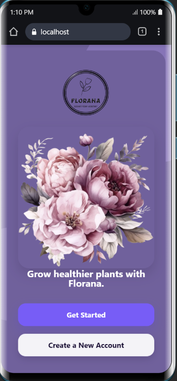
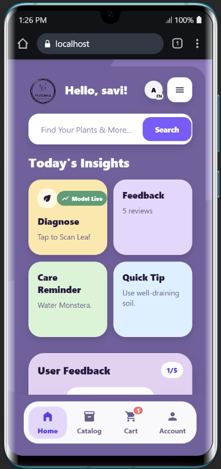
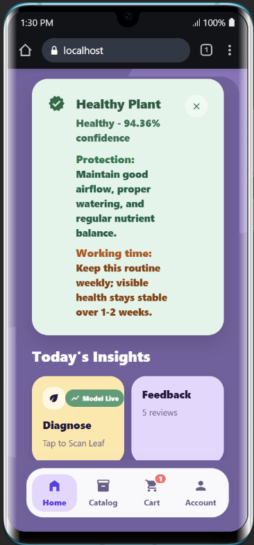
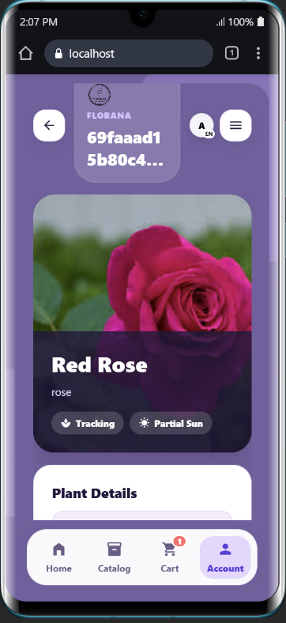
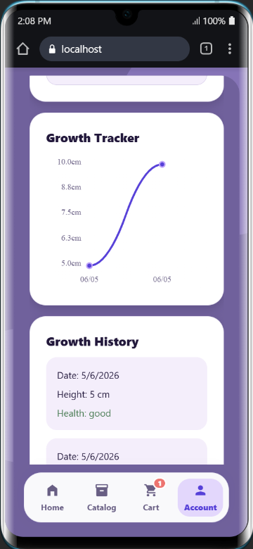
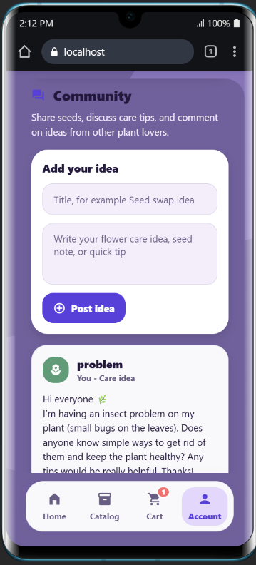
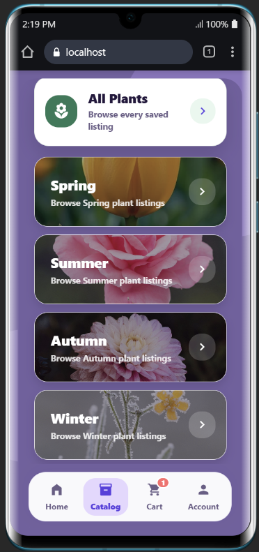
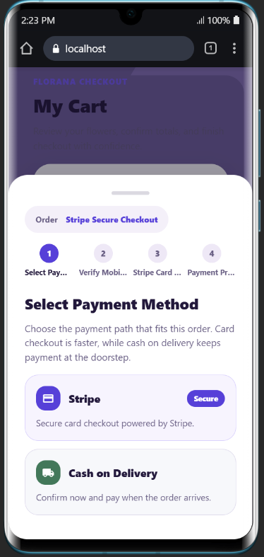
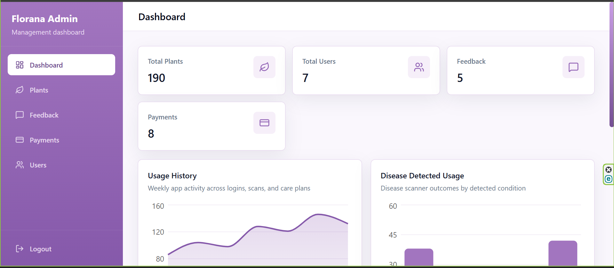

# Florana - Smart Flower Plant Care & Disease Detection Mobile Application ( Plymouth ID-10953498)

<div align="center">

## Smart Plant Care, Disease Detection, and Seasonal Flower Shopping

Florana is a final-year project that combines a mobile plant-care experience, AI-assisted disease prediction, growth tracking, reminders, shopping, and admin management in one connected platform.

`Expo React Native` `FastAPI` `TensorFlow / Keras` `Admin Dashboard` `MongoDB`

</div>

## Project Showcase

Florana is a final-year project for flower plant care, flower plant disease detection, growth tracking, and flower plant shopping. It combines an Expo React Native mobile app, a FastAPI backend, a TensorFlow/Keras disease prediction model, an admin dashboard, and a legacy React web client.

## 1. Project Title

Project name:

```text
Florana - Smart Flower Plant Care & Disease Detection Mobile Application
```

Tagline:

```text
AI-powered flower plant health monitoring, care management, and seasonal flower shopping platform.
```

## 2. Project Overview / Description

Florana helps flower plant owners identify flower plant diseases from uploaded images, register and monitor their flowering plants, manage care reminders, and browse or sell seasonal flower plants through a built-in shop.

The project is designed for home gardeners, flower plant collectors, small flower plant sellers, and students who need a practical flower plant health management system. It solves common problems such as delayed disease identification, missed flower care tasks, disconnected flower plant records, and manual flower shop/order handling.

Main capabilities:

- AI-powered flower plant disease detection from image uploads
- Flower plant health monitoring and flower profile management
- Growth tracking with charts
- Care reminders, quick tips, and a local Quick Tip community space
- Seasonal flower plant shop with cart and checkout flow
- Admin dashboard for managing users, flower plants, products, feedback, and orders

## Project Completion Status

Florana is structured as a multi-module final-year project with the main mobile application, backend API, admin dashboard, legacy web client, and ML training workflow included in one repository.

Completed project areas:

- Mobile application screens and navigation are implemented in `mobile/src/screens/`.
- Backend API routes are implemented in `backend/routes/` and `backend/main.py`.
- Disease prediction model files are included in `backend/ai/`.
- Admin dashboard pages are implemented in `admin-dashboard/src/pages/`.
- ML dataset download and training workflow is documented and scripted in `ml_pipeline/`.
- Root npm scripts are available for running the backend, mobile app, admin dashboard, and legacy web client.

## Documentation Map

Use these files depending on what you need:

- `README.md`
  Full repository overview, architecture, setup, backend routes, and module summary
- `mobile/README.md`
  Detailed guide for the Expo mobile app, screens, translations, reminders, and Expo startup flow
- `PAYMENT_SYSTEM_GUIDE.md`
  Payment-specific implementation notes

## Repository Modules

Top-level modules in this repository:

| Folder | Purpose |
| --- | --- |
| `mobile/` | Main Expo React Native application |
| `backend/` | FastAPI backend, auth, AI model runtime, storage, payments, and reminder APIs |
| `admin-dashboard/` | React + Vite admin management dashboard |
| `florana/` | Older legacy React web client kept for reference |
| `ml_pipeline/` | Dataset download and model training workflow |
| `uploads/` | Local development upload storage |

## Current Mobile Notes

The mobile app currently includes:

- Expo Router-based entry routes in `mobile/app/`
- Screen implementations in `mobile/src/screens/`
- Shared providers in `mobile/src/context/`
- Shared translations in `mobile/src/utils/translations.ts`
- Translation fixes and newer mobile copy in `mobile/src/utils/translationOverrides.ts`

Recent mobile documentation points:

- Care Reminder language content now uses the shared translation system instead of isolated page-only copy
- Supported mobile language choices are English, Sinhala, Tamil, Spanish, French, Arabic, Hindi, and Chinese
- Mobile-specific setup and troubleshooting are documented in `mobile/README.md`
- Catalog browsing and plant selling now use separate mobile screens for a cleaner user flow
- The mobile cart now includes a more polished payment UI with structured delivery fields, payment method cards, and improved Stripe/COD checkout states
- Mobile shop prices now use a live currency conversion flow with cached fallback rates and shared formatting across catalog, product, sell, season, cart, and checkout screens

## 3. Features

### Core Features

- User registration and login
- Flower plant disease prediction from image upload
- Flower plant registration with image, city, sunlight, soil, climate, and care details
- My Flower Plants dashboard with flower profile view and delete support
- Flower plant care tracking and growth history
- Care reminders and custom care notes
- Quick Tip community for sharing seeds, posting care ideas, liking posts, commenting, and chatting locally
- Flower plant shop with seasonal catalog, product details, cart, and checkout
- Dedicated Sell Flower Plants flow for adding shop listings with photo upload and preview
- Live currency conversion for LKR, USD, and EUR with app-wide synchronized pricing
- Feedback, profile, settings, help, and about screens
- Local JSON fallback storage when MongoDB is not connected

### Advanced Features

- Location-aware flower plant registration using Sri Lankan city options
- Seasonal catalog for Spring, Summer, Autumn, and Winter flower plants
- Personalized quick tips based on time, season, and tracked flower plants
- Device-saved Quick Tip community posts, likes, comments, and chat messages using AsyncStorage
- Growth tracking charts for registered flower plants
- Multi-language app text support
- Real-time currency switching for shop prices with cached rate fallback and shared checkout totals
- Admin analytics summary for users, flower plants, products, feedback, payments, and revenue
- Optional Cloudinary dataset download workflow for ML training

### Planned / Future Advanced Features

- Live weather API integration for flower care recommendations
- Push notification improvements
- Chatbot flower care assistant
- Flower plant doctor consultation workflow
- IoT sensor integration for soil moisture and environment tracking

### Implemented Mobile Screens

- Welcome
- Login and registration
- Home dashboard
- Disease prediction
- My Flower Plants
- Register Flower Plant
- Flower plant profile / flower profile
- Growth chart view
- Quick Tips with community posts, likes, comments, and chat
- Care Reminder
- Catalog
- Sell
- Season catalog
- Product details
- Cart
- Feedback
- Profile
- Settings
- Help
- About

### Implemented Admin Dashboard Pages

- Dashboard summary
- Users
- Flower Plants
- Orders / payments
- Feedback

The repository still contains additional admin page components under `admin-dashboard/src/pages/`, but the current routed dashboard navigation exposes only the pages listed above.

## 4. Tech Stack

### Frontend

- Expo
- React Native
- TypeScript
- React Native SVG
- React Native Chart Kit
- AsyncStorage

### Admin Dashboard

- React
- Vite
- JavaScript
- Tailwind CSS
- Recharts
- Axios

### Legacy Web Client

- React
- JavaScript
- React Router
- Axios
- Chart.js

### Backend

- FastAPI
- Python
- Uvicorn
- Pydantic
- python-jose
- Passlib
- JWT authentication utilities
- Local JSON fallback storage

### Database

- MongoDB
- Local JSON files for development fallback

### AI/ML

- TensorFlow
- Keras
- CNN image classification model
- Pillow / OpenCV image preprocessing
- NumPy

### Cloud Services

- Cloudinary for optional ML dataset download workflow
- Stripe configuration support for payment intent flow
- Firebase Admin SDK support for notification integration when configured

## Prerequisites

- Node.js and npm
- Python 3.10+ recommended
- Expo Go or Android/iOS emulator for mobile testing
- MongoDB for persistent storage
- Optional Cloudinary account for ML dataset download workflow
- Optional Stripe keys for live card payment testing

## 5. System Architecture

```text
Mobile App / Admin Dashboard / Legacy Web Client
                |
                v
        FastAPI Backend API
                |
   --------------------------------
   |              |               |
MongoDB     Local JSON       TensorFlow Model
Database    Fallback         Disease Prediction
   |
   v
Uploads served from /uploads during development
```

Main flow:

- Users interact with the Expo mobile app.
- The mobile app sends auth, flower plant, prediction, shop, payment, feedback, and reminder requests to the FastAPI API.
- The backend stores records in MongoDB when available.
- If MongoDB is unavailable, the backend falls back to local JSON storage.
- Uploaded images are saved locally and served through `/uploads`.
- Disease prediction uses the trained TensorFlow/Keras model in `backend/ai/`.
- The admin dashboard uses protected `/admin` endpoints to manage the system.
- The ML pipeline can download datasets from Cloudinary and train/export model artifacts.

## 6. Folder Structure

```bash
Florana-FYP/
|-- admin-dashboard/        # Vite React admin dashboard
|-- backend/                # FastAPI backend, routes, auth, uploads, payments, AI model
|-- florana/                # Legacy React web client
|-- ml_pipeline/            # Dataset download and TensorFlow model training workflow
|-- mobile/                 # Expo React Native mobile application
|-- uploads/                # Local development uploads, ignored by Git
|-- PAYMENT_SYSTEM_GUIDE.md # Payment flow documentation
|-- README.md
`-- package.json            # Root scripts for backend, mobile, admin, and web
```

## 7. Installation

### Clone Repository

```bash
git clone https://github.com/msnavodya/Florana-FYP.git
cd Florana-FYP
```

### Install JavaScript Dependencies

```bash
npm install
npm --prefix mobile install
npm --prefix admin-dashboard install
npm --prefix florana install
```

### Install Backend Python Dependencies

Using the existing project virtual environment path:

```bash
.\.venv\Scripts\python.exe -m pip install -r backend\requirements.txt
```

Or create a new virtual environment:

```bash
python -m venv .venv
.\.venv\Scripts\Activate.ps1
pip install -r backend\requirements.txt
```

### Install ML Pipeline Dependencies

```bash
cd ml_pipeline
pip install -r requirements.txt
```

## 8. Running the Project

### Backend

Start the FastAPI backend from the repository root:

```bash
npm run backend:start
```

This command is safe to run every day. If the Florana backend is already using
port `8000`, it will reuse that server instead of starting a second Uvicorn
process.

Run with reload only during development:

```bash
npm run backend:start:reload
```

Check or restart the backend:

```bash
npm run backend:status
npm run backend:restart
npm run backend:stop
```

Type only the command itself. Do not add explanation text after the command.
For example, use `npm run backend:restart`, not
`npm run backend:restart to start fresh`.

Avoid starting the backend with raw `uvicorn main:app --port 8000` while another
backend is already open, because Uvicorn will try to bind the same port again
and Windows will raise `[Errno 10048]`.

Backend default URL:

```text
http://localhost:8000
```

API docs:

```text
http://localhost:8000/docs
```

### Mobile App

The mobile app uses `mobile/scripts/start-expo.js`. This helper starts Expo and
also checks the backend before Expo opens:

- If a healthy Florana backend is already running on port `8000`, Expo reuses it.
- If no backend is running, the helper tries to start the backend automatically.
- If another service is using the backend port, the helper chooses the next
  available backend port and passes that URL to Expo for the current session.

Start the Expo app:

```bash
npm start
```

Run Android:

```bash
npm run android
```

Run iOS:

```bash
npm run ios
```

Run mobile app in the browser:

```bash
npm run web
```

For Expo Go on a real phone, set `EXPO_PUBLIC_API_BASE_URL` to your computer LAN IP and keep both devices on the same Wi-Fi network.

Recommended daily startup:

```bash
npm run backend:start
npm start
```

If you need a fresh backend, run this exact command:

```bash
npm run backend:restart
```

If you only run `npm start`, backend messages may appear in the same terminal
because the Expo helper is checking or starting the backend for you. That is
expected behavior in this project.

Do not use raw `uvicorn main:app --host 0.0.0.0 --port 8000` for daily startup.
Use the npm backend scripts so duplicate backend processes are handled safely.

### Admin Dashboard

Start the admin dashboard:

```bash
npm run admin:start
```

Build the admin dashboard:

```bash
npm run admin:build
```

### Legacy Web Client

Start the legacy React web client:

```bash
npm run legacy:web:start
```

Build the legacy React web client:

```bash
npm run legacy:web:build
```

### Model / Prediction

The production prediction endpoint is served by the backend:

```text
POST /predict
```

The model files used by the backend are:

```text
backend/ai/plant_disease_model.keras
backend/ai/class_names.json
```

To train or update the model, use the workflow in `ml_pipeline/`.

### Root Scripts

| Script | Purpose |
| --- | --- |
| `npm run backend:start` | Start FastAPI backend on port `8000` |
| `npm run backend:start:reload` | Start backend with reload |
| `npm run backend:status` | Check whether backend is healthy |
| `npm run backend:restart` | Stop the old backend and start a fresh backend |
| `npm run backend:stop` | Stop the backend on port `8000` |
| `npm start` | Start Expo mobile app and reuse/start backend if needed |
| `npm run android` | Start Expo Android target and reuse/start backend if needed |
| `npm run ios` | Start Expo iOS target and reuse/start backend if needed |
| `npm run web` | Start Expo web target |
| `npm run admin:start` | Start admin dashboard |
| `npm run admin:build` | Build admin dashboard |
| `npm run payment:mobile` | Start the mobile checkout flow in the Expo app |
| `npm run payment:backend` | Start the optional legacy Flask Stripe checkout backend |
| `npm run legacy:web:start` | Start legacy React web client |
| `npm run legacy:web:build` | Build legacy React web client |
| `npm run mobile:typecheck` | Run mobile TypeScript check |

## 9. Environment Variables

Copy the example files before running locally:

```bash
copy backend\.env.example backend\.env
copy mobile\.env.example mobile\.env
```

The FastAPI backend runner and the optional Flask payment backend both load
`backend/.env` automatically.

### Backend `.env`

```env
MONGO_URL=mongodb://localhost:27017
JWT_SECRET_KEY=replace_with_a_long_random_secret
STRIPE_SECRET_KEY=sk_test_your_secret_key_here
STRIPE_PUBLISHABLE_KEY=pk_test_your_publishable_key_here
STRIPE_WEBHOOK_SECRET=whsec_your_webhook_secret_here
PUBLIC_BASE_URL=http://YOUR_LAN_IP:5000
DEFAULT_RETURN_URL=florana-payments://checkout-result
HOST=0.0.0.0
PORT=8000
ALLOWED_ORIGINS=http://localhost:8081,http://127.0.0.1:8081,http://localhost:8083,http://127.0.0.1:8083,http://YOUR_LAN_IP:8083
ALLOWED_RETURN_URL_PREFIXES=exp://,exps://,florana-payments://,https://auth.expo.io/
```

`JWT_SECRET_KEY` is read by `backend/utils/security.py` and should be set in any shared or production environment. `STRIPE_PUBLISHABLE_KEY` is optional for the current API response payload but is useful if you extend the mobile checkout with Stripe client-side SDK support.

### Mobile `.env`

```env
EXPO_PUBLIC_API_BASE_URL=http://YOUR_COMPUTER_LAN_IP:8000
```

### ML Pipeline Cloudinary Config

The ML pipeline uses `ml_pipeline/config_template.py`. Copy it to `config.py` and add:

```python
CLOUDINARY_CONFIG = {
    "cloud_name": "your_cloud_name",
    "api_key": "your_api_key",
    "api_secret": "your_api_secret"
}
```

Do not commit real credentials, `.env` files, `config.py`, local uploads, datasets, or generated caches.

## 10. API Endpoints

Important backend routes:

| Method | Endpoint | Purpose |
| --- | --- | --- |
| `GET` | `/health` | Check backend, database, and AI model status |
| `POST` | `/auth/signup` | Register user |
| `POST` | `/auth/login` | Login user |
| `POST` | `/predict` | Predict flower plant disease from uploaded image |
| `GET` | `/history` | Get prediction history |
| `GET` | `/plants` | Get legacy/simple flower plant list |
| `GET` | `/plants/` | Get registered flower plants |
| `POST` | `/plants/` | Register flower plant |
| `DELETE` | `/plants/{plant_id}` | Delete flower plant |
| `GET` | `/plants/by-name/{name}` | Get flower plant profile by name |
| `POST` | `/growth/` | Add growth record |
| `GET` | `/growth/{plant_id}` | Get growth records |
| `GET` | `/quick-tips` | Get personalized care tips |
| `GET` | `/shop/products` | Get shop products |
| `POST` | `/shop/products` | Add shop product |
| `DELETE` | `/shop/products/{product_id}` | Delete shop product |
| `POST` | `/payments/intent` | Create payment intent |
| `POST` | `/payments/confirm` | Save confirmed order/payment |
| `POST` | `/payments/payment-notify` | Legacy payment notification route |
| `POST` | `/feedback/` | Submit feedback |
| `GET` | `/feedback/` | Get feedback |
| `DELETE` | `/feedback/` | Clear feedback |
| `GET` | `/care-reminders/` | Get care reminder settings |
| `PUT` | `/care-reminders/` | Save care reminder settings |
| `POST` | `/care-reminder` | Legacy reminder scheduling route |

Admin routes are protected and use the `/admin` prefix:

| Method | Endpoint | Purpose |
| --- | --- | --- |
| `GET` | `/admin/summary` | Admin dashboard summary |
| `GET` | `/admin/users` | Manage users |
| `GET` | `/admin/plants` | Manage flower plants |
| `GET` | `/admin/products` | Manage shop products |
| `GET` | `/admin/feedback` | Manage feedback |
| `GET` | `/admin/payments` | Manage orders/payments |
| `DELETE` | `/admin/plants/{plant_id}` | Delete flower plant as admin |
| `DELETE` | `/admin/products/{product_id}` | Delete product as admin |
| `DELETE` | `/admin/payments/{payment_id}` | Delete payment record as admin |

Uploaded images are served from:

```text
/uploads/<filename>
```

## 11. Screenshots

The completed runtime screenshots used for GitHub presentation are stored in `docs/screenshots/`.

### Mobile App Preview

| Screen | Preview |
| --- | --- |
| Welcome screen |  |
| Home dashboard |  |
| Disease diagnosis result |  |
| Plant profile |  |
| Growth tracker and history |  |
| Community screen |  |
| Seasonal catalog |  |
| Checkout and payment method |  |

### Admin Dashboard Preview

| Screen | Preview |
| --- | --- |
| Admin dashboard |  |

### Screenshot Files

| Screen | File |
| --- | --- |
| Welcome screen | `docs/screenshots/welcome-screen.png` |
| Home dashboard | `docs/screenshots/home-dashboard.png` |
| Disease diagnosis result | `docs/screenshots/diagnosis-result.png` |
| Plant profile | `docs/screenshots/plant-profile.png` |
| Growth tracker and history | `docs/screenshots/growth-tracker.png` |
| Community screen | `docs/screenshots/community.png` |
| Seasonal catalog | `docs/screenshots/catalog.png` |
| Checkout and payment method | `docs/screenshots/checkout.png` |
| Admin dashboard | `docs/screenshots/admin-dashboard.png` |

## 12. Dataset Information

The ML pipeline supports downloading image datasets from Cloudinary, organizing them by class folders, and training a CNN image classifier.

Current backend class labels:

- Botrytis
- Fresh Leaf
- Leaf Spot
- Powdery Mildew
- Rust

Image preprocessing:

- Convert uploaded image to RGB
- Resize image to `224x224`
- Convert image to array
- Normalize pixel values to `0-1`
- Run TensorFlow/Keras model prediction

Dataset workflow:

- Configure Cloudinary credentials in `ml_pipeline/config.py`
- Download images with `download_dataset.py`
- Organize images into class folders
- Train using `train_model.py` or `train.py`
- Export model artifacts for backend use

## 13. Model Details

- Model type: CNN image classification model
- Framework: TensorFlow / Keras
- Input size: `224x224x3`
- Output: multi-class disease prediction
- Backend model file: `backend/ai/plant_disease_model.keras`
- Class labels file: `backend/ai/class_names.json`
- Confidence threshold: backend returns `Needs closer inspection` for low-confidence predictions
- Current backend class count: 5
- Current classes: Botrytis, Fresh Leaf, Leaf Spot, Powdery Mildew, Rust

Accuracy depends on the dataset used for the latest training run. The repository includes the trained backend model artifact and the full training pipeline, so final validation accuracy and confusion matrix results can be recorded from the training output.

## Current Repository Status

- Main branch: `main`
- GitHub repository: `https://github.com/msnavodya/Florana-FYP.git`
- Main client: `mobile/`
- Backend default port: `8000`
- Database: MongoDB with local JSON fallback
- Upload storage during development: local `/uploads`
- AI model runtime files: `backend/ai/plant_disease_model.keras` and `backend/ai/class_names.json`

## 14. Future Enhancements

- Live weather-based flower plant care recommendations
- Push notifications through Firebase for scheduled reminders
- Chatbot assistant for flower care questions
- Flower plant doctor consultation booking
- Community forum or shared flower plant posts
- IoT soil moisture and temperature integration
- Cloud deployment for backend, admin dashboard, and database
- Cloud image storage for uploaded flower plant and product images
- More disease classes and larger training dataset

## 15. Contributors

- Florana Development Team
- GitHub: [msnavodya](https://github.com/msnavodya)

## 16. License

This project is prepared for academic/final-year project submission. No separate open-source license file is currently included in the repository.

## 17. Contact

- GitHub Repository: [Florana-FYP](https://github.com/msnavodya/Florana-FYP)
- GitHub Profile: [msnavodya](https://github.com/msnavodya)
- Email: sadininavodya@gmail.com
- LinkedIn: www.linkedin.com/in/sadini-navodya-0305362ab
- Project contact can be made through the GitHub repository profile and issues.

## Verification

Useful checks before pushing changes:

```bash
npm run mobile:typecheck
npm run admin:build
.\.venv\Scripts\python.exe -m py_compile backend\main.py backend\routes\plant.py backend\routes\shop.py backend\routes\admin.py
```

## Git Notes

Ignored local files include virtual environments, `node_modules`, environment files, local uploads, generated caches, and large local datasets. Commit source code, configuration examples, documentation, and intended static assets only.
